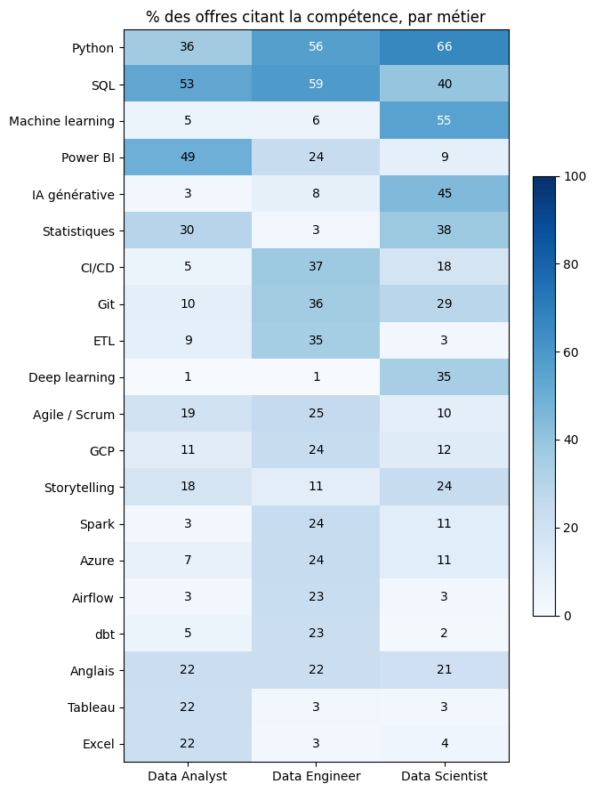
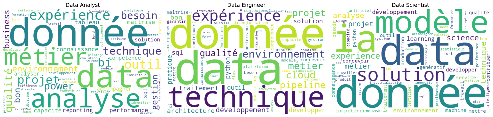
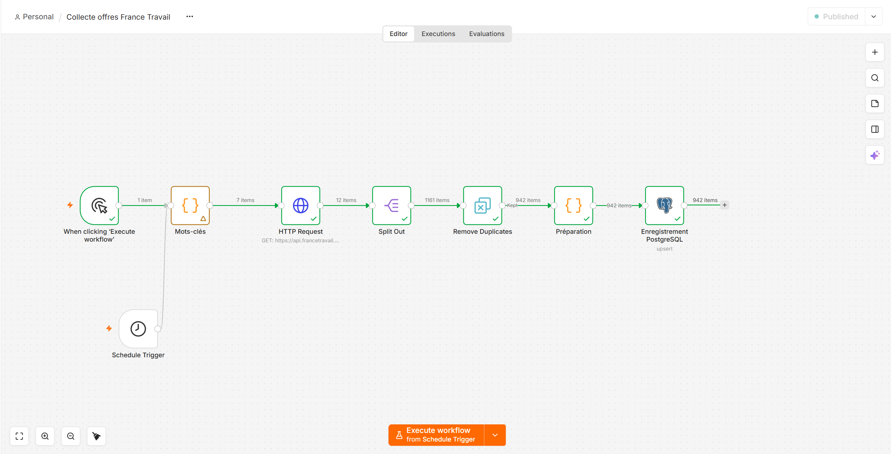

# Le marché de l'emploi Data en France : ce que demandent vraiment les recruteurs

Analyse NLP de **443 offres d'emploi** Data Analyst, Data Engineer et Data Scientist publiées sur France Travail (collecte du 04/10/2026).

## Questions métier

1. Quelles compétences sont les plus demandées pour un Data Analyst en France ?
2. En quoi le profil Data Analyst se distingue-t-il des profils Data Engineer et Data Scientist ?
3. Le marché francilien se distingue-t-il du reste de la France ?
4. Peut-on reconnaître le métier à partir de la seule description de l'offre ?
5. Que demandent les offres accessibles aux débutants ?

## Résultats clés

- **SQL (53 %) et Power BI (49 %)** forment le socle du Data Analyst, devant Python (36 %) et les statistiques (30 %). Power BI est cité **deux fois plus souvent que Tableau** (22 %).
- **Trois métiers bien distincts** : la BI et l'analyse métier pour le Data Analyst, l'infrastructure pour le Data Engineer (CI/CD 37 %, Git 36 %, ETL 35 %), la modélisation pour le Data Scientist (machine learning 55 %). L'**IA générative** est déjà citée dans **45 % des offres Data Scientist**.
- **Sans le nom du poste**, un modèle TF-IDF + régression logistique reconnaît le métier dans **87 % des cas** (contre 43 % pour un modèle naïf). Les erreurs concernent surtout des postes hybrides ou des intitulés qui ne reflètent pas les missions.
- **47 % des offres Data Analyst acceptent les débutants** : elles demandent les mêmes compétences, en citent moins, mais sont moins souvent en CDI (44 % contre 66 % pour les postes expérimentés).
- L'**Île-de-France concentre 57 % des offres** ; hors Île-de-France, les offres Data Analyst citent davantage Power BI (57 % contre 44 %) et Excel (28 % contre 17 %).





## Démarche

| Étape | Méthode |
|---|---|
| Collecte | API Offres d'emploi v2 (France Travail), OAuth2, pagination |
| Préparation | Déduplication (1 163 lignes → 904 offres uniques), étiquetage du métier par règles sur l'intitulé (→ 443 offres), masquage du nom du métier |
| NLP | Stopwords français adaptés, lemmatisation spaCy (`fr_core_news_sm`) |
| Exploration | Dictionnaire de compétences (regex, contrôlé manuellement), WordClouds, termes distinctifs TF-IDF |
| Robustesse | Analyse de sensibilité sur l'émetteur dominant (21 % des offres Data Analyst) |
| Modélisation | Bag of Words / TF-IDF + régression logistique (F1 macro, matrice de confusion, analyse des erreurs) |
| Restitution | Exports CSV prêts pour un dashboard Power BI (à venir) |
| Automatisation | Collecte quotidienne n8n → PostgreSQL, sous Docker |

## Limites

- **Instantané** à une date donnée, sans saisonnalité.
- **Biais de source** : France Travail ne couvre qu'une partie du marché (Indeed, LinkedIn, Welcome to the Jungle, APEC, Cadremploi, cabinets de recrutement…).
- **Petits effectifs** : 10 offres seulement en Pays de la Loire, d'où une comparaison Île-de-France / reste de la France ; 89 offres de test pour le modèle.
- **Étiquetage par règles** et **dictionnaire de compétences** imparfaits, malgré les contrôles manuels.
- **BoW / TF-IDF ignorent le contexte** (« SQL apprécié » = « SQL indispensable »).

## Collecte quotidienne automatisée

L'analyse repose sur un instantané. Pour suivre le marché dans la durée, la collecte est automatisée avec **n8n** et **PostgreSQL**, orchestrés par **Docker Compose** :



| Étape | Nœud n8n |
|---|---|
| Déclenchement | Chaque jour à 10 h (Schedule Trigger) |
| Collecte | 7 mots-clés, appel de l'API avec authentification OAuth2 gérée par n8n et pagination automatique |
| Préparation | Une ligne par offre, dédoublonnage par `id`, étiquetage du métier (mêmes règles que le notebook) |
| Stockage | *Upsert* dans PostgreSQL : nouvelle offre insérée, offre déjà connue mise à jour (`last_seen`) |

Les colonnes `first_seen` et `last_seen` permettront de mesurer **la durée de publication des offres** et de suivre **l'évolution des compétences demandées** semaine après semaine. Le JSON complet de chaque offre est conservé (`raw`, type `JSONB`) pour pouvoir affiner les règles sans recollecter.

## Évolutions prévues

- Brancher le notebook sur PostgreSQL pour analyser l'évolution dans le temps et, avec assez de données, le marché nantais.
- Extraction des salaires (renseignés dans environ un tiers des offres).
- Dashboard Power BI.

## Reproduire

**Analyse (notebook)**

```bash
pip install -r requirements.txt
python -m spacy download fr_core_news_sm
cp .env.example .env   # identifiants francetravail.io + mot de passe PostgreSQL
jupyter notebook notebooks/analyse_offres_data.ipynb
```

Par défaut, `COLLECTER_DONNEES = False` : le notebook relit le dernier fichier de `data/raw/`, ce qui garantit des résultats identiques à ceux présentés ici. Ce dossier n'étant pas versionné, mettre `COLLECTER_DONNEES = True` (avec ses propres identifiants dans `.env`) pour lancer une nouvelle collecte.

**Collecte automatisée (n8n + PostgreSQL)**

```bash
docker compose up -d   # lit .env ; PostgreSQL crée les tables au premier démarrage (sql/init.sql)
```

Ouvrir n8n sur `http://localhost:5678`, importer `n8n/collecte_offres.json`, puis créer deux identifiants : *Postgres* (hôte `postgres`, port 5432) et *OAuth2 API* (France Travail, grant type *Client Credentials*).

## Structure

```
nlp-offres-data/
├── notebooks/
│   └── analyse_offres_data.ipynb   # analyse NLP complète
├── data/
│   ├── raw/                        # offres brutes (non versionnées)
│   └── processed/                  # agrégats pour le dashboard
├── n8n/
│   └── collecte_offres.json        # workflow de collecte quotidienne
├── sql/
│   └── init.sql                    # schéma PostgreSQL (tables et vues)
├── image/
│   ├── heatmap_competences.png
│   ├── wordclouds.png
│   └── n8n_workflow.png
├── dashboard/                      # fichier Power BI (à venir)
├── docker-compose.yml              # n8n + PostgreSQL
├── .env.example
├── requirements.txt
└── README.md
```

## Autrice

Xiaoqing ZHOU GRANDCOING — Data Analyst · [GitHub](https://github.com/XiaoqingGdc) · [LinkedIn](https://www.linkedin.com/in/xiaoqingzhougrandcoing)

Données : API Offres d'emploi, France Travail ([francetravail.io](https://francetravail.io)).
